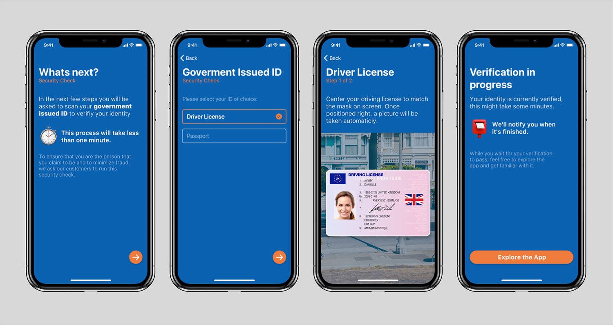

# FAQ

## Table of Content
- [Improving user experience and reducing drop-off rate](#improving-user-experience-and-reducing-drop-off-rate)
- [Reducing the size of your app](#reducing-the-size-of-your-app)
	- [Strip unused frameworks](#strip-unused-frameworks)
	- [Bitcode](#bitcode)
- [Jumio Support](#jumio-spport)

### Improve user experience and reducing drop-off rate
When evaluating user flows, one of the most commonly used metrics is the rate of drop-offs. At Jumio, we see considerable variance in drop-off rates across industries and customer implementations. For some implementations and industries, we see a higher rate of drop-offs on the first screens when compared with the average. 
Scanning an ID with sensitive personal data printed on it naturally creates a high barrier for participation on the part of the end user. Therefore, conversion rates can be significantly influenced when the application establishes a sense of trust and ensures that users feel secure sharing their information.

One pattern that is recognizable throughout all of our customers’ SDK implementations: the more seamless the SDK integration, and the better job is done of setting user expectations prior to the SDK journey, the lower the drop-off rate becomes.
  
Our SDK provides a variety of customization options to help customers achieve a seamless integration. For customers using the standard SDK workflow, our [Surface tool](https://jumio.github.io/surface-ios/) provides an easy-to-use WYSIWYG interface to see simple customization options that can be incorporated with minimal effort and generate the code necessary to implement them. For customers who want to have more granular control over look and feel, our SDK offers the [CustomUI](https://github.com/Jumio/mobile-sdk-ios/blob/master/docs/integration_netverify-fastfill.md#custom-ui) option, which allows you to customize the entire user interface.

#### Example case:

- Default SDK UI is used and is presented on one of the first screens during onboarding. The user is unprepared for the next steps and might not understand the intention behind the request to show their ID.

#### Suggested improvements with additional customization:

 - Host application has an explanatory help screen that explains what will happen next and why this information is needed.
 - SDK is either customized to have a more embedded appearance or [CustomUI](https://github.com/Jumio/mobile-sdk-ios/blob/master/docs/integration_netverify-fastfill.md#custom-ui) is used to create a completely seamless integration in the UX of our customers.
 - Also after the Jumio workflow that shows the displayed results and/or a message that the ID is currently verified, which might take some minutes.
  
### Reducing the size of your app
The Netverify SDK contains a wide range of different scanning methods. The SDK is able to capture identity documents and extract information on the device using enhanced machine learning and computer vision technologies. The current download size of the sample application containing the SDK is mentioned in the [setup guide](https://github.com/Jumio/mobile-sdk-ios#manually). If you want to reduce the size of the SDK within your application, there are several ways to achieve this.

#### Strip unused frameworks
Depending on your specific needs, you may want to strip out unused functionality. As most of our frameworks can be linked optionally, you can reduce file size by simply not adding them to your project.

The following table shows a range of different product configurations with the frameworks that are required and the corresponding application size. These measurements are based on our sample application after being uploaded to the Appstore.

| Product | Size | JumioCore | BAMCheckout | Netverify | NetverifyBarcode & MicroBlink | NetverifyFace & ZoomAuthenticationHybrid |
| :--- | :---: | :---: | :---: | :---: | :---: | :---: |
| Netverify + Authentication | 25.4 MB | x |  | x | x | x |
| Fastfill | 10.8 MB | x |  | x | x |  |
| Fastfill without Barcode | 7.67 MB | x |  | x |  |  |
| Document Verification | 7.67 MB | x |  | x |  |  |
| BAM Checkout credit card scanning | 7.12 MB | x | x |  |  |  |
| BAM Checkout credit card + ID scanning | 30.8 MB | x | x | x | x | x |

In case you use a combination of these products, make sure to add frameworks only once to your app and that those frameworks are linked and embedded in your Xcode project.

The size values in the table above depict the decompressed install size required on a device. It can be compared with the Estimated App Store files size. The size value can vary by a few percent, depending on the actual device used. Testing conducted by Jumio using iPhone X.

#### Bitcode
Bitcode is an intermediate representation of a compiled program. Apps you upload to App Store Connect that contain bitcode will be compiled and linked on the App Store. Including bitcode will allow Apple to re-optimize your app binary in the future without requiring you to submit a new version of your app to the App Store.

For iOS apps, bitcode is the default, but is optional.
If you provide bitcode, all apps and frameworks in the app bundle (all targets in the project) need to include bitcode.

Read more about bitcode in the [Apple documentation](https://help.apple.com/xcode/mac/current/#/devbbdc5ce4f).

### Jumio Support
The Jumio development team is constantly striving to optimize the size of our frameworks while increasing functionality, to improve your KYC and to fight fraud. If you have any further questions, please reach out to our [support team](mailto:support@jumio.com).

